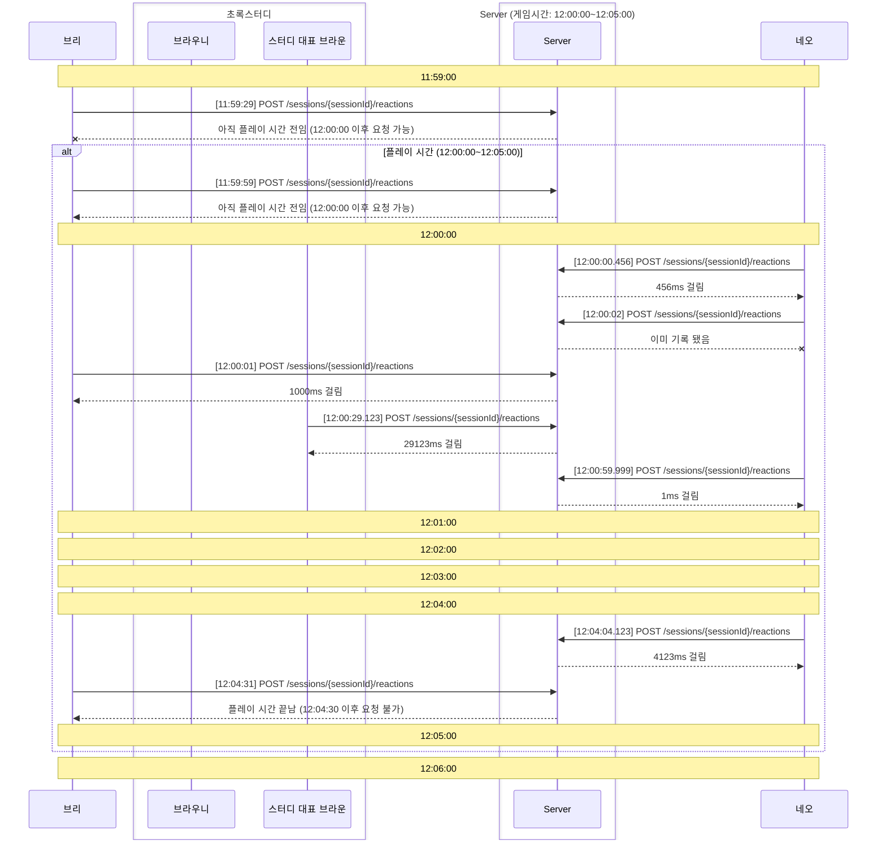
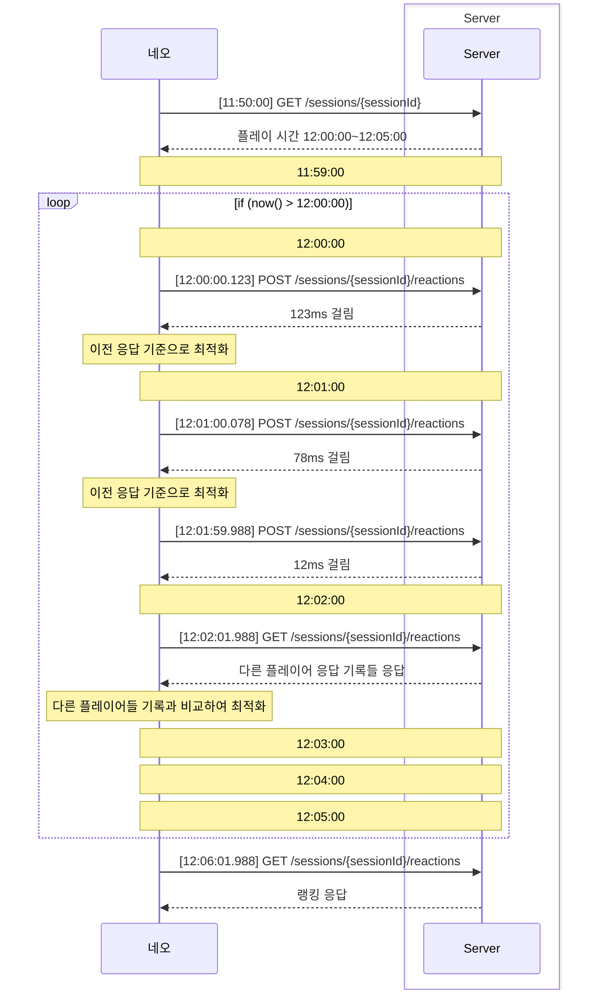

# Reaction Game

## 게임 소개

해당 게임은 클라이언트가 서버로 요청을 보내어 매 분 정각에 가까운 시간에 반응 시간을 측정하는 게임입니다.

매 분은 60초 단위로 정의하며, 0초부터 29.999초까지는 이전 분의 시간으로 처리되고, 30초부터 59.999초까지는 다음 분의 시간으로 처리됩니다.

e.g. 00:00.000 ~ 00:29.999는 00:00으로 처리되고, 00:30.000 ~ 00:59.999는 01:00.000으로 처리됩니다.

서버와 클라이언트 통신 사이엔 여러 변수가 존재하며 이러한 변수들을 고려하여 반응 시간을 예상하는 것이 중요합니다. 
여러 변수의 예시는 다음과 같습니다.

1. 클라이언트와 서버의 시간차이
2. 클라이언트의 반응 시간
3. 서버의 반응 시간
4. 네트워크 지연 시간
5. 애플리케이션 처리 방식

이 과정에서 서버와 클라이언트의 통신을 경험하고, 서버와 클라이언트의 통신에 대한 이해를 높일 수 있습니다.

## 게임 규칙

게임에 참여하는 클라이언트는 다음과 같은 규칙을 지켜야 합니다.

1. 운영자에게 게임 참여 의사를 전달하여 계정 고유 식별자(X-PLAYER-TOKEN)과 세션의 고유 식별자(Session Id)를 전달 받는다. 
    - 게임은 팀으로 참여할 수 있고, 혼자 팀을 만들어 참여할 수도 있다.
    - 단, 혼자 두 팀에 참여할 수 없다.
2. 게임 시작 시간에 맞춰 클라이언트는 서버에 요청을 보내 반응 시간을 측정한다.
    - 계정 고유 식별자(X-PLAYER-TOKEN)은 헤더에 포함되어야 하며, 세션의 고유 식별자(Session Id)는 URL에 포함되어야 한다. 
    - 서버에 문제가 될 수 있을 정도의 요청을 보내는 것은 금지된다.
    - 만약 서버에 요청하지 않았다면 최대 시간인 30초로 처리된다.
3. 서버는 클라이언트의 요청을 받아 반응 시간을 측정하고, 클라이언트에게 결과를 전달한다.
4. 클라이언트는 서버로부터 받은 결과를 이용하여 최적화된 방법으로 다음 요청을 보낸다.
5. 게임이 끝나면 서버는 클라이언트의 기록을 기반으로 순위를 매긴다.

## 플레이 시나리오

#### 가장 기본적인 플레이 예시

#### 개선한 플레이 예시

