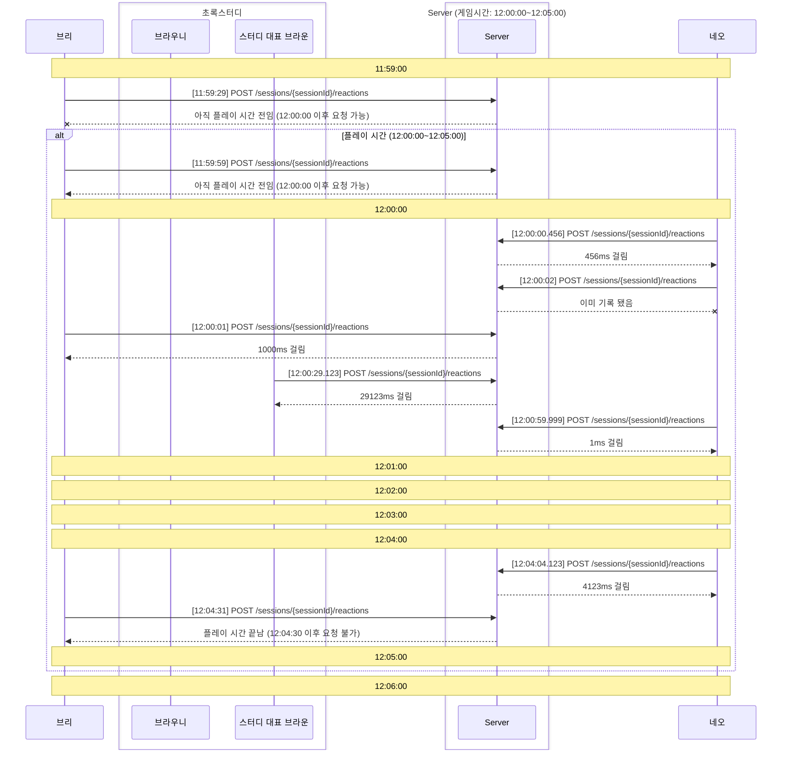
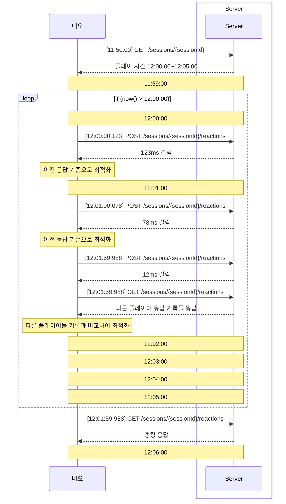

# Reaction Game

## 게임 소개

해당 게임은 클라이언트가 서버로 요청하는 여러 고려사항을 계산하여 최대한 정확하게 시간을 측정하는 게임입니다.

여러 고려사항의 예시는 다음과 같습니다.

1. 클라이언트와 서버의 시간차이
2. 클라이언트의 반응 시간
3. 서버의 반응 시간
4. 네트워크 지연 시간
5. 애플리케이션 처리 방식

이 외에도 이전에 요청한 기록을 기준으로 다음 요청에 대한 처리를 최적화 할 수도 있습니다.

## 게임 목적

해당 게임의 목적은 자신만의 접근 방법으로 남들보다 정확하게 시간을 측정하여 최고의 기록을 세우는 것입니다.

그 과정에서 서버와 클라이언트의 통신을 경험하고, 이를 통해 서버와 클라이언트의 통신에 대한 이해를 높일 수 있습니다.

## 게임 방법

게임은 다음과 같은 순서로 진행됩니다.

1. 관리자에게 게임에 참여하고 싶다는 의사를 전달합니다.
2. 관리자는 클라이언트에게 게임에 참여할 수 있는 토큰과 SessionId를 발급합니다.
3. 클라이언트는 발급받은 토큰과 SessionId를 이용하여 서버에 요청을 보내 게임의 진행 시간을 확인합니다.
4. 게임 시작 시간에 맞춰 클라이언트는 서버로부터 요청을 보내어 반응 시간을 측정합니다.
5. 서버는 클라이언트의 요청을 받아 반응 시간을 측정하고, 클라이언트에게 결과를 전달합니다.
6. 클라이언트는 서버로부터 받은 결과를 이용하여 최적화된 방법으로 다음 요청을 보냅니다.
7. 게임이 끝나면 서버는 클라이언트의 기록을 기반으로 순위를 매깁니다.

## 게임 규칙

게임에 참여하는 클라이언트는 다음과 같은 규칙을 지켜야 합니다.

1. 게임에 참여하기 위해서는 관리자에게 참여 의사를 전달해야 합니다.
2. 게임은 팀으로 참여할 수 있고, 혼자 팀을 만들어 참여할 수도 있습니다.
   다만 두 팀에 참여할 수 없습니다.
3. 게임에 참여하는 클라이언트는 반드시 관리자로 부터 발급받은 토큰과 SessionId를 이용하여 요청을 보내야 합니다.
4. 서버에 문제가 될 수 있을 정도의 요청을 보내는 것은 금지됩니다.
5. 만약 서버에 요청하지 않았다면 최대 시간인 30초로 처리됩니다.

## 플레이 시나리오

#### 가장 기본적인 플레이 예시

#### 개선한 플레이 예시

